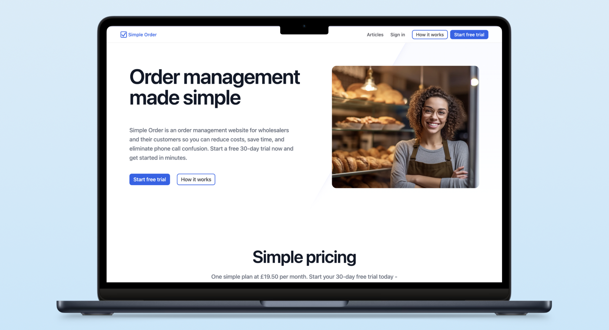

# Simple Order

SAAS order management website for wholesalers.

This is a clone of a private repository created for portfolio purposes. The original contains sensitive configuration files, database schemas, and other production-related code that I want to keep private for the security of my customers.

# Technology

- Next.js App Router (the full-stack framework built on top of React) deployed with Vercel
- PostgreSQL deployed with Neon
- Drizzle type-safe SQL query builder
- Mailgun email service
- Tailwind CSS

Please see my [developer website write-up](http://danedwardsdeveloper.com/projects/simple-order) for more details.
